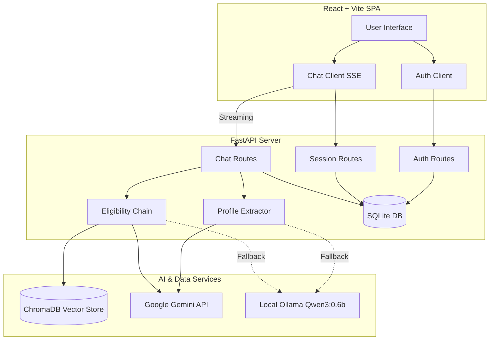

# System Architecture

The Government Scheme RAG Assistant is built on a modern, decoupled client-server architecture. It prioritizes low latency, high resilience (via AI fallbacks), and a smooth user experience using Server-Sent Events (SSE).

## High-Level Architecture Map

## Component Breakdown

### 1. Frontend (Client)
- **Framework**: React 18, Vite.
- **Styling**: Tailwind CSS.
- **State Management**: React Hooks (`useState`, `useEffect`).
- **Communication**: 
  - Axios for standard REST calls (Auth, Sessions).
  - Native `fetch` with `TextDecoderStream` for consuming Server-Sent Events (SSE) from the chat endpoint.
- **Key Modules**:
  - `ChatWindow`: Handles message rendering, markdown parsing (`react-markdown`), and the typing indicator.
  - `MessageBubble`: Distinguishes user messages, assistant replies, and collapsible `<think>` reasoning blocks.
  - `SchemeCard`: Renders matched schemes on the right sidebar.

### 2. Backend (Server)
- **Framework**: FastAPI.
- **Concurrency**: Asynchronous endpoints, synchronous database and LLM calls executed safely via threading.
- **Data Persistence**: SQLite (`rag_assistant.db`) using WAL mode for performance. Tracks Users, Sessions, and Messages.
- **Key Routes**:
  - `POST /api/chat`: The core engine. Executes profile extraction, RAG retrieval, eligibility matching, and streams the conversational reply back.
  - `POST /api/login` & `/api/register`: Custom JWT-less auth utilizing salted `scrypt` hashing.

### 3. Retrieval-Augmented Generation (RAG) Layer
- **Vector Database**: ChromaDB (Persistent local storage).
- **Embeddings**: `paraphrase-multilingual-MiniLM-L12-v2` (Local, executed via `sentence-transformers`).
- **Generation LLM (Primary)**: Google Gemini (`gemini-2.5-flash`) via the `google-genai` SDK.
- **Generation LLM (Fallback)**: Local Ollama daemon running `qwen3:0.6b`.

## Request Lifecycle (Chat)

1. **User Input**: User submits a message via the React UI.
2. **Database Persistence**: FastAPI immediately saves the user message to SQLite.
3. **Profile Extraction**: The conversation history is sent to Gemini to extract structured demographic data (Age, State, Income, etc.).
4. **Vector Retrieval**: The extracted profile is converted into a natural language query and embedded. ChromaDB returns the top `k` most similar schemes.
5. **Eligibility Evaluation**: Gemini evaluates the top schemes strictly against the extracted profile, returning a filtered JSON array of "Eligible" or "Partial Match" schemes.
6. **Streaming Response**: The backend yields the scheme metadata immediately to the frontend, then asks Gemini to generate a conversational reply, streaming the text back chunk-by-chunk via SSE.
7. **Database Persistence**: The final assistant reply is saved to SQLite.
