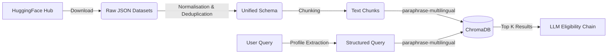

# Retrieval-Augmented Generation (RAG) Pipeline

This document outlines how unstructured government scheme data is ingested, processed, and served by the RAG architecture.

## Pipeline Overview



## 1. Data Ingestion & Normalisation
The pipeline begins by pulling open-source datasets from the Hugging Face Hub (`satyajitdas/bharatschemes-v1` and `shrijayan/gov_myscheme`). 

The `server/scraper/prepare_datasets.py` script normalises these disparate JSON structures into a unified format:
- **Deduplication**: Schemes are merged based on exact name matches to prevent vector crowding.
- **Unified Schema**:
  ```json
  {
    "scheme_id": "str",
    "name": "str",
    "details": "str",
    "benefits": "str",
    "eligibility_criteria": "str",
    "application_process": "str",
    "url": "str"
  }
  ```

## 2. Text Chunking
Unlike traditional document RAG where massive PDFs are chunked into 500-token segments, government schemes are highly structured. 

The chunking strategy employed here is **Scheme-Level Aggregation**. 
Instead of splitting a scheme into multiple chunks (which risks losing context, e.g., separating the age criteria from the caste criteria), the `prepare_datasets.py` script synthesizes the core attributes into a single dense chunk per scheme:
```text
Scheme: [Name]
Details: [Details]
Benefits: [Benefits]
Eligibility: [Eligibility Criteria]
Target Beneficiaries: [List]
```
This guarantees that ChromaDB retrieves the *entire* context of a scheme at once.

## 3. Embedding Model
The system uses **`paraphrase-multilingual-MiniLM-L12-v2`** running locally via `sentence-transformers`.

**Why this model?**
1. **Multilingual Capabilities**: Indian citizens frequently query in regional languages (Hindi, Tamil, Hinglish). This model maps 50+ languages to the same latent space as English. An English scheme document will successfully match a Hindi query.
2. **Local Execution**: Removing the dependency on external embedding APIs (like OpenAI or Gemini) eliminates embedding latency, reduces API costs to zero for the vector building phase, and allows for complete offline vector store regeneration.
3. **Dimensionality**: Produces 384-dimensional vectors, which are extremely fast to search in ChromaDB compared to 1536-d or 768-d models.

## 4. Vector Storage
Vectors and their associated metadata are stored in a persistent local **ChromaDB** instance (`server/vectorstore/chroma_db/`).

When the user queries the system, the profile is flattened into a descriptive string (e.g., *"I am 30 years old from Tamil Nadu working as a farmer..."*) and embedded using the same multilingual model. ChromaDB performs a Cosine Similarity search to return the top `k` (usually 10) candidate schemes.
